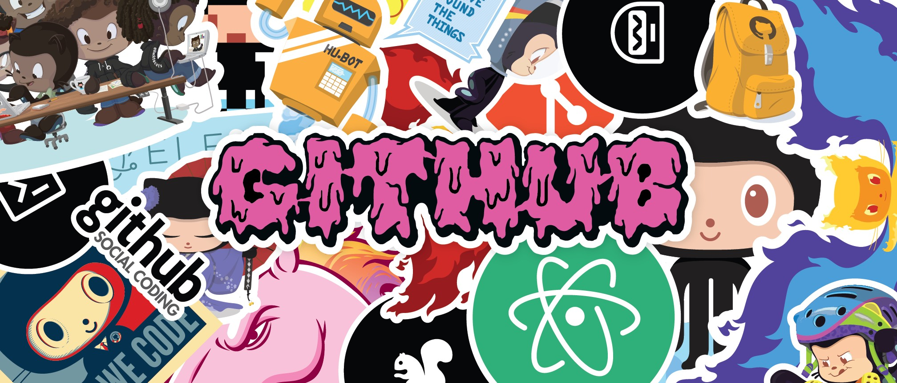

<!--

##  Hi there 👋 

<h1 align="center">
  Hi 👋, I'm Unmish Roy
  
</h1>
-->
<!-- Capsule waving header -->

<!-- Custom image -->

  

<!-- First GIF before "Hi there" -->

<!-- Name with second GIF beside -->
<h1 align="center">
    
  Hi 👋, I'm Unmish Roy
  
</h1>

<h3 align="center">A Passionate Developer | Web3 & AI Enthusiast </h3>

  

- 🎓 I’m currently in my final year of **Electronics and Communication Engineering**
- 🌱 I’m diving deep into **Generative AI** and **Full-stack Development**
<!-- - 🚀 Final Year Project: Building an **AI-powered Resume Analyzer** using MERN + OpenAI + Docker + AWS-->
- 💡 Exploring projects in **Blockchain**, **AI for Web**, and **Agentic AI**
- 📫 How to reach me: [unmish.roy.dev@gmail.com](mailto:unmish.roy.dev@gmail.com)

---

### 🚀 Tech Stack

- 💻 Languages: `Python`, `JavaScript`, `C++`, `solidity`
- 🌐 Web: `React.js`, `Node.js`, `Express.js`, `MongoDB`, `Next.js`
- 🧠 AI/ML: `Scikit-learn`, `Pandas`, `LLMs`,`Numpy`,`Matplotlib`,`Tensorflow`,`Langchain`
- 🔗 Blockchain: `Algorand`, `IPFS`, `Smart Contracts`
- 🛠️ Tools: `Git`, `Docker`, `Linux`, `Firebase`, `Postman`

---

### 🧩 Notable Projects

- 🔐 **Statuscode** – A decentralized file-sharing platform built on Web3  
  🔗 [GitHub](https://github.com/DipakKumarChauhan/Statuscode)

- 🧠 **AI Virtual Assistant with Voice Command Integration** – An AI multilingual Virtual Assistant 
 🔗 [GitHub](https://github.com/Unmish6969/Virtual-Assistant.git)
 
- 🕵️‍♂️ **Anomaly Detection in Epilepsy Using EEG Signals** – Designed and implemented a deep learning pipeline using 1D CNN, LSTM, and GRU models to classify epileptic
episodes with 97% accuracy. 
  🔗 [GitHub](https://github.com/hellspit/Anomaly-Detection-in-EEG-Signals-for-Epilepsy-prediction.git)
---

### 📊 GitHub Stats

  
  

---

### 📫 Let’s Connect

  
  

---

*Crafted with ❤️ by Unmish Roy*
<!--
**Unmish6969/Unmish6969** is a ✨ _special_ ✨ repository because its `README.md` (this file) appears on your GitHub profile.

Here are some ideas to get you started:

- 🔭 I’m currently working on ...
- 🌱 I’m currently learning ...
- 👯 I’m looking to collaborate on ...
- 🤔 I’m looking for help with ...
- 💬 Ask me about ...
- 📫 How to reach me: ...
- 😄 Pronouns: ...
- ⚡ Fun fact: ...
-->
